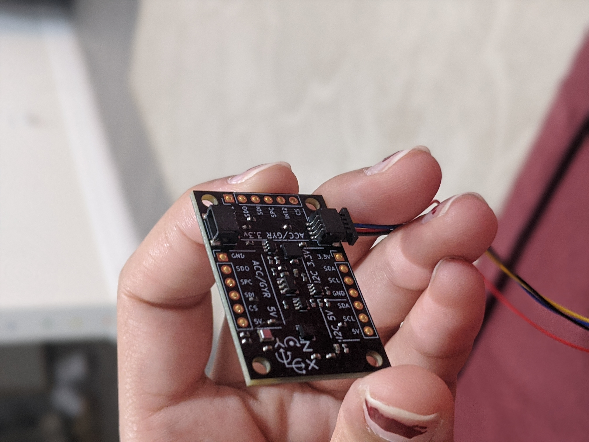
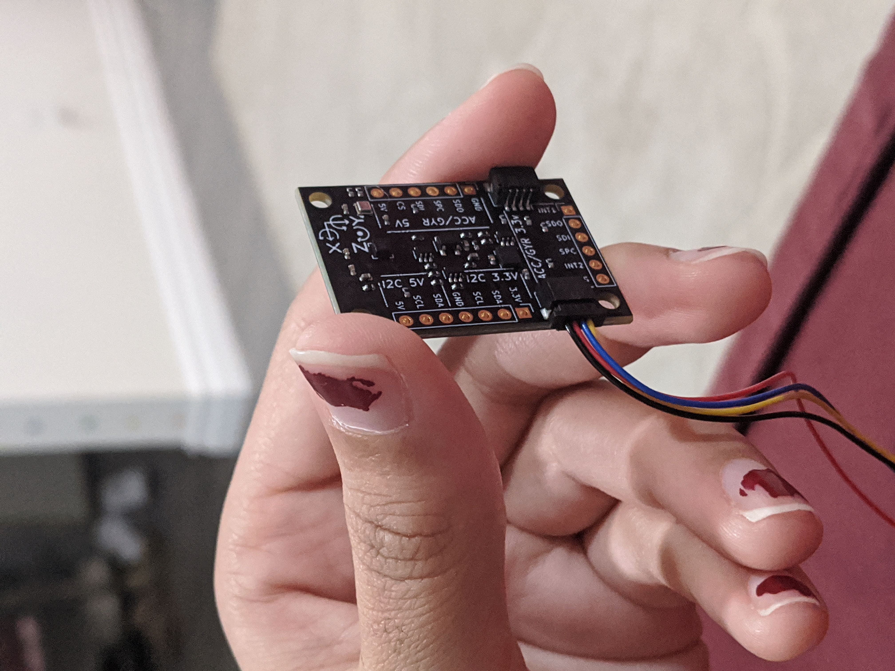
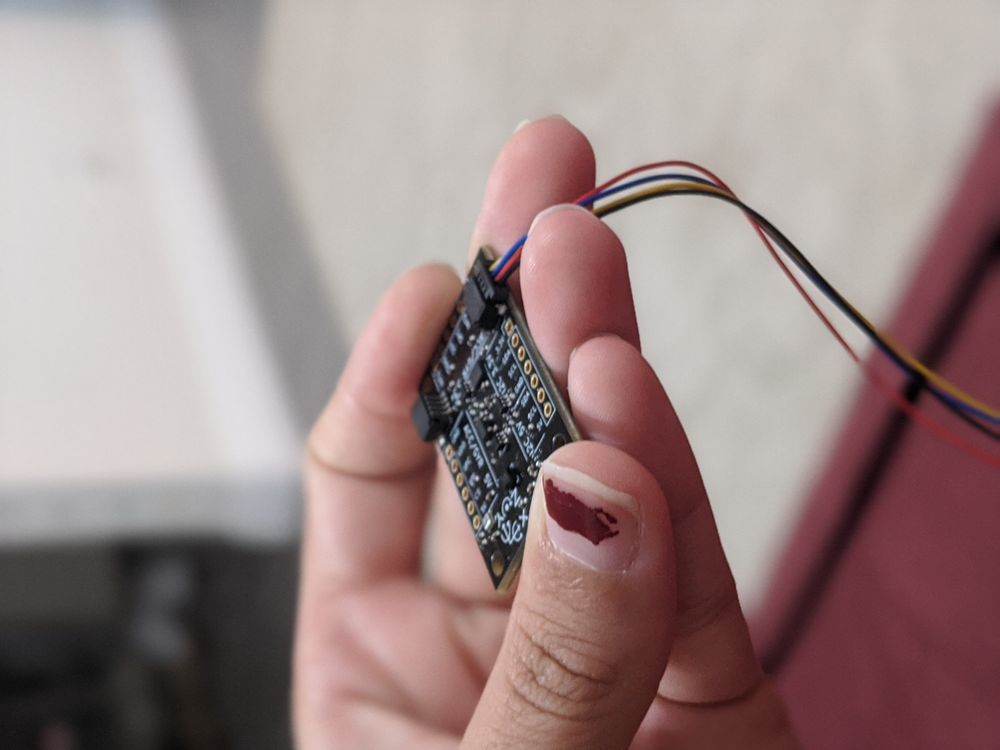
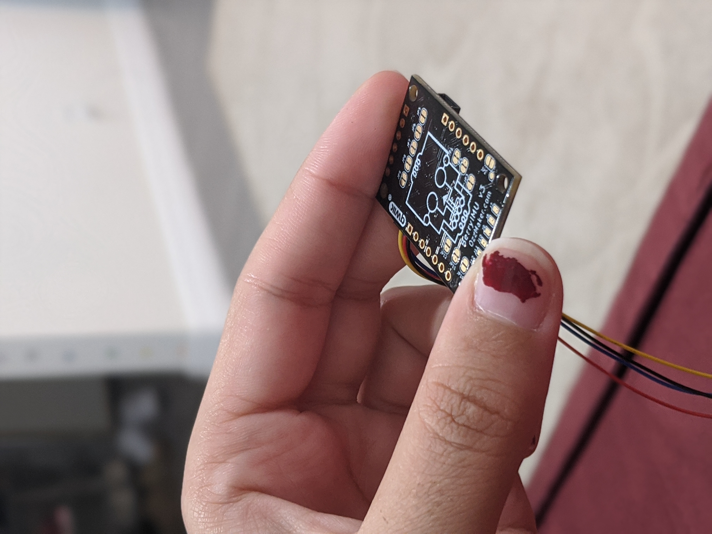

# A-Maze

A-maze, an interactive indoor game designed to test a user’s memory and dexterity, was designed to entertain children and young adults indoors, while involving some physical movement and stimulating the brain.

## Web Application

The web application is located [here](https://amaze-webapp.herokuapp.com/). The web app shows a player leaderboard, sortable by level, and player history for each individual user.

## Game Controls

### Keyboard Controls

- Forward/back/left/right: arrow keys/ WASD
- Rotate camera: 'z' (left) 'x' (right)
- Jump: space bar
- Duck: Left Shift
- Pause Menu: Esc

### IMU Controls

|                          Neutral                          |                          Forward                          |                          Left                          |                          Right                          |
| :-------------------------------------------------------: | :-------------------------------------------------------: | :----------------------------------------------------: | :-----------------------------------------------------: |
|  |  |  |  |

### Voice Commands

On Main Menu:

- "Back", "Log Out": log out and return to Start Screen
- "Levels": Open Level Selection Screen
- "Help": Open Help menu (not yet implemented)
- "Quit": Quit game

On Level Selection Screen:

- "Back": Return back to Main Menu
- "Zero", "Tutorial": Start Tutorial Level
- "One": Load Level 1
- "Two": Load Level 2
- "Three": Load Level 3
- "Four": Load Level 4

On 'Are You Ready' Screen:

- "Yes": start game
- "No": go back to level selection menu

While Playing Game

- "Stop", "Pause": open pause menu

On Pause Menu

- "Start", "Resume": resume game
- "Menu": goes to Main Menu
- "Quit", "Exit": exit game

On End Screen

- "Menu": goes to Main Menu

### Web Cam

Ensure your arms are in frame, even when jumping. Best performance is when you are 1-3 ft from your webcam. Also, make sure you are not swapping too quickly between movements. After a failed attempt, wait around a 1-2 seconds before re-attempting the movement.


|                                                                           Jump                                                                            |                                                           Duck                                                            |
| :-------------------------------------------------------------------------------------------------------------------------------------------------------: | :-----------------------------------------------------------------------------------------------------------------------: |
| Light jumps are acceptable when 1-3 ft from the camera. Ensure to not duck too much before jumping, as this will be recognized as a duck instead of jump. | Small ducks are also acceptable, given you are 1-3 ft from the camera. Quick ducks are more recognizable than slow ducks. |

## Download the Game

The Unity and Movenet executables are downloadable [here](https://drive.google.com/drive/folders/1vBoH45YPad5u9VueUC_M-a9Gt_FOG-vU?usp=sharing). Currently supported platforms are MacOS 64-bit and Windows 10 64-bit. If these do not work for you, you can compile the code from source using the "Compilation" instructions in the next section.

Note: when running the executable, you may have to disable some security permissions. For Mac, see [this](https://forum.unity.com/threads/the-application-cannot-be-opened.404388/) for debugging help.

To set up the Rpi controller, follow the raspberry pi instructions.

## Raspberry Pi

1. SSH into raspberry pi

   ```
   $ ssh pi@raspberrypi.local
   ```

2. Install all dependencies on raspberry pi

   ```
   $ pip install paho-mqtt
   $ pip install numpy
   ```

3. Replace `your_username` with the username you sign into Unity with

   ```
   $ cd IMU
   $ echo -e "[UserConfig]\nUsername=your_username" > config.ini
   ```

4. Startup Script for Raspberry Pi

   ```
   $ vim .bashrc
   ```

   At the bottom of the file, add the following:

   ```
   $ sudo python IMU/berryIMU.py
   ```

   Note: If you have the repository in a different directory, please update the path above.
   To save in vim, press the following: ESC-:wq.

5. Reboot Raspberry Pi

   ```
   sudo shutdown -r now
   ```

   After you SSH into the raspberry pi again, the startup script will run.

## Compilation

If you cannot download our executables, you can clone our source code and compile it yourself.

### Create Build Directory Structure

To use our automated scripts and ensure proper relative paths, you will need to make sure you have created the proper directory structure at the root of the project repo. The structure is as follows:

```
Team2
--| Build
----| Movenet
------ models/*
------ dist/*
----| Unity
------ MazeProject.exe
```

Make the directory at the root of the project, and copy the models from `Movenet/models` to `Build/Movenet/models`.

### Unity

1. Download [Unity Hub](https://unity3d.com/get-unity/download).

2. Within Unity Hub, install Unity Editor version 2018.4.36f1. We recommend you use this version to ensure cross-compatability.

3. Within Unity Hub, choose "Open" -> "Add project from disk" -> select Unity subdirectory of this project.

4. [Build](https://docs.unity3d.com/2018.4/Documentation/Manual/PublishingBuilds.html) the game executable.

### Movenet

1. Download [Python3](https://www.python.org/downloads/) and [pip](https://pip.pypa.io/en/stable/installation/)
2. Download dependencies.

   ```
   $ cd Setup_Scripts
   $ pip install -r movenet_requirements.txt
   ```

3. Build

   ```
   $ cd Setup_Scripts
   # For windows, open build_movenet.bat in cmd prompt instead
   $ ./build_movenet
   ```

## Resources

We would like to give attribution to the following Resources.

By level, the following audio sources were used:

- Maze Level 0: "Riviera" by Maarten Schellekens
- Maze Level 1: "04 Night-Shadows" by Ketsa
- Maze Level 2 and 4: "Flowers Don't Say Anything, They Just Think" by One Man Book
- Maze Level 3: "Nocturn" by M33 Project

The background used in the Unity in-game menus are credited to user3802032 on freepik.com
